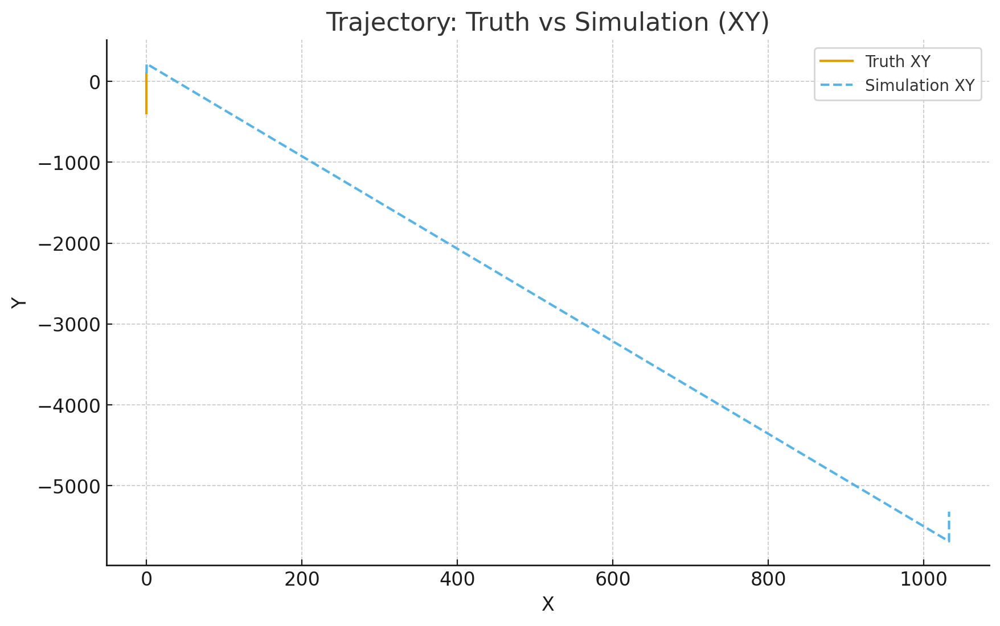
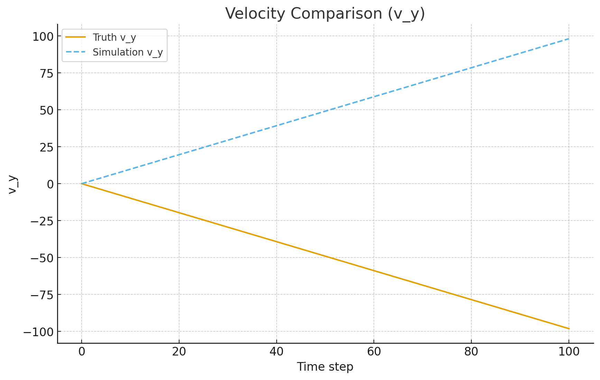

<p align="left">
  <a href="https://www.mathworks.com/products/matlab.html"></a>
  <a href="./LICENSE"></a>
  
</p>


# Trajectory Simulation

MATLAB scripts for generating and comparing trajectories against truth data.

## Contents
- `scripts/Trajectory_generator.m`
- `scripts/Trajectory_generator_ver2.m`
- `scripts/Distance_checker_tool_v1.m`
- `scripts/fence_generator.m`

## Quickstart
```matlab
run_demo
```

## Example Results




## Requirements
- MATLAB R2022a or newer
- Recommended: Signal Processing Toolbox (for radar), Aerospace/Mapping toolboxes as noted


## Installation
```bash
git clone https://github.com/<your-username>/<repo-name>.git
cd <repo-name>
```


## Data
Place required CSVs into the `data/` folder. See Quickstart for filenames.


## Results
Figures are saved under `results/`.

---

### 🤝 Contributing
Issues and PRs are welcome. Please open an issue to discuss significant changes.

### 📜 License
This project is licensed under the MIT License — see [LICENSE](./LICENSE) for details.

### ⭐ Acknowledgments
If this saved you time, consider giving the repo a star!
